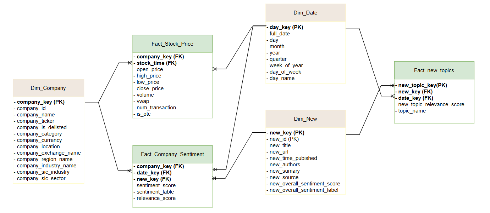
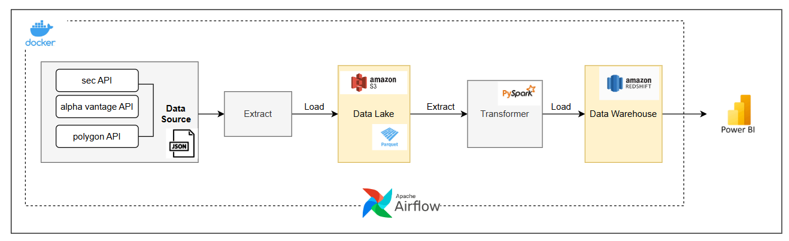

<h1 align="center">📊 FINACIAL DATA WAREHOUSE</h1>

# Chương 1: THIẾT KẾ DATA WAREHOUSE
## 1.1 Tìm hiểu nguồn dữ liệu
&nbsp;&nbsp;&nbsp;&nbsp;Nguồn dữ liệu được lấy từ các API do các tổ chức chuyên cung cấp dữ liệu cho thị trường chứng khoán, bao gồm các API sau:

### a. Sec-api
&nbsp;&nbsp;&nbsp;&nbsp; - Source: [sec-api.io – List Companies by Exchange](https://sec-api.io/docs/mapping-api/list-companies-by-exchange).  
&nbsp;&nbsp;&nbsp;&nbsp; - API này giúp truy xuất danh sách các công ty đang niêm yết trên các sàn chứng khoán như:
  **NYSE, NASDAQ, NYSEMKT, NYSEARCA, OTC, BATS, INDEX.**  
&nbsp;&nbsp;&nbsp;&nbsp; - Dữ liệu từ API trả về sẽ bao gồm các thuộc tính sau: 
  
| **Attribute**        | **Description** |
|----------------------|-----------------|
| `name`               | Tên công ty đã niêm yết trên sàn chứng khoán |
| `ticker`             | Ký hiệu trên sàn giao dịch chứng khoán (mã giao dịch cổ phiếu của công ty)   → Dùng để tra cứu và xác định giá cổ phiếu |
| `cik`   `(central index key)` | Mã định danh duy nhất cho mỗi công ty đã đăng ký với SEC (U.S Securities and Exchange Commission)  → Tra cứu thông tin chi tiết của công ty trong các báo cáo của SEC |
| `cusip`              | Mã định danh duy nhất để nhận diện chứng khoán ở Mỹ (bao gồm cổ phiếu và trái phiếu)  → Dùng để theo dõi chứng khoán, phân tích đầu tư và quản lý rủi ro |
| `exchange`           | Sàn chứng khoán nơi cổ phiếu của công ty được niêm yết |
| `isDelisted`         | Giá trị Boolean. Cho biết cổ phiếu đã bị hủy niêm yết hay chưa |
| `category`           | Hạng mục cổ phiếu |
| `sector`             | Ngành kinh tế mà công ty hoạt động |
| `industry`           | Ngành cụ thể của công ty |
| `sic`   `(Standard Industry Classification)` | Mã ngành nghề theo hệ thống phân loại SIC của chính phủ Mỹ |
| `sicSector`          | Ngành rộng theo mã SIC |
| `sicIndustry`        | Ngành cụ thể theo mã SIC |
| `famasection`        | Ngành theo mô hình Fama-French, phân chia theo yếu tố rủi ro và lợi suất (giá trị, tăng trưởng, quy mô,...) |
| `famaIndustry`       | Ngành cụ thể trong hệ thống phân loại của Fama-French |
| `currency`           | Đơn vị tiền tệ cổ phiếu được giao dịch (VD: USD, EUR) |
| `location`           | Địa chỉ hoặc khu vực hoạt động chính của công ty |
| `id`                 | Định danh công ty |

### b. Alpha Vantage
**API for market status*  
&nbsp;&nbsp;&nbsp;&nbsp;- Source: [alphavantage.co - Market Status](https://www.alphavantage.co/documentation/#market-status).   
&nbsp;&nbsp;&nbsp;&nbsp;- API này cũng cấp thông tin về các thị trường chứng khoáng trên toàn thế giới.  
&nbsp;&nbsp;&nbsp;&nbsp;- Dữ liệu sau khi thu thập sẽ bao gồm các thuộc tính sau:  

| Attribute           | Description                                         |
|---------------------|-----------------------------------------------------|
| `market_type`       | Loại thị trường                                     |
| `region`            | Khu vực thị trường                                  |
| `primary_exchanges` | Sàn giao dịch chính                                 |
| `local_open`        | Thời gian mở cửa địa phương                         |
| `local_close`       | Thời gian đóng cửa địa phương                       |
| `current_status`    | Tình trạng hiện tại của thị trường                  |

**API for news sentimets*  
&nbsp;&nbsp;&nbsp;&nbsp;- Source: [alphavantage.co - News Sentiment](https://www.alphavantage.co/documentation/#news-sentiment).   
&nbsp;&nbsp;&nbsp;&nbsp;- API Alpha Vantage cung cấp thông tin về sentiment của các tin tức và cảm xúc thị trường liên quan đến cổ phiếu. 
&nbsp;&nbsp;&nbsp;&nbsp;- Dữ liệu sau khi thu thập sẽ bao gồm các thuộc tính sau:  
| Attribute                  | Description                                      |
|----------------------------|--------------------------------------------------|
| `title`                    | Tiêu đề bài viết                                 |
| `url`                      | Đường dẫn bài viết                               |
| `time_published`           | Thời gian xuất bản                               |
| `authors`                  | Tác giả                                          |
| `summary`                  | Tóm tắt bài viết                                 |
| `source`                   | Nguồn tin                                        |
| `source_domain`            | Tên miền của nguồn tin                           |
| `topics`                   | Danh sách chủ đề liên quan                       |
| `relevance_score`          | Điểm độ liên quan của bài viết                   |
| `overall_sentiment_score`  | Điểm cảm xúc tổng thể                            |
| `overall_sentiment_label`  | Nhãn cảm xúc tổng thể                            |
| `ticker_sentiment`         | Cảm xúc của cổ phiếu                             |
| `ticker`                   | Mã cổ phiếu                                      |
| `ticker_sentiment_score`   | Điểm cảm xúc của cổ phiếu                        |
| `ticker_sentiment_label`   | Nhãn cảm xúc của cổ phiếu                        |

### c. Polygon
&nbsp;&nbsp;&nbsp;&nbsp;- Source: [polygon.io - Daily Market Summary](https://polygon.io/docs/rest/stocks/aggregates/daily-market-summary).   
&nbsp;&nbsp;&nbsp;&nbsp;-	API này giúp truy xuất dữ liệu OHRC(giá mở cửa, cao nhất, thấp nhất và đóng cửa) hàng ngày của tất cả các cổ phiếu trên thị trường chứng khoán mỹ. 
&nbsp;&nbsp;&nbsp;&nbsp;- Dữ liệu sau khi thu thập sẽ bao gồm các thuộc tính sau:  
| Attribute | Description                                                                 |
|-----------|-----------------------------------------------------------------------------|
| `T`       | Mã cổ phiếu – Ký hiệu đại diện cho cổ phiếu của công ty trên sàn giao dịch |
| `o`       | Giá mở cửa (Open Price) – Mức giá đầu tiên được giao dịch trong ngày     |
| `h`       | Giá cao nhất (High Price) – Mức giá cao nhất cổ phiếu đạt được trong ngày |
| `l`       | Giá thấp nhất (Low Price) – Mức giá thấp nhất cổ phiếu rơi xuống trong ngày |
| `c`       | Giá đóng cửa (Close Price) – Mức giá cuối cùng của cổ phiếu trong ngày giao dịch |
| `v`       | Khối lượng giao dịch (Volume) – Tổng số lượng cổ phiếu được mua bán trong ngày |
| `vw`      | Giá trung bình theo khối lượng (Volume Weighted Average Price) – Giá trung bình có trọng số theo khối lượng giao dịch, thể hiện xu hướng giá thực tế trong ngày |
| `n`       | Số lượng giao dịch (Number of Transactions) – Tổng số lần giao dịch diễn ra trong ngày |
| `t`       | Thời gian giao dịch (Timestamp) – Mốc thời gian thể hiện ngày diễn ra giao dịch, thường được biểu thị theo Unix Epoch (miliseconds) |
## 1.2 Phân tích các bussiness process
&nbsp;&nbsp;&nbsp;&nbsp; Giả sử, hiện nay công ty đang muốn tạo các data mart từ dữ liệu vừa thu thập được với các mục đích sau:  
a.	Phân tích biến động của cổ phiếu  
&nbsp;&nbsp;&nbsp;&nbsp; - 	Theo dõi các chỉ số OHLC (Open, High, Low, Close) của từng cổ phiếu theo từng khung thời gian (ngày, tuần, tháng, quý, năm).  
&nbsp;&nbsp;&nbsp;&nbsp; -	Phân tích xu hướng giá cổ phiếu (tăng, giảm, đi ngang).  
&nbsp;&nbsp;&nbsp;&nbsp; -	Dự đoán xu hướng giá tương lai dựa trên dữ liệu lịch sử và chỉ số phân tích kỹ thuật.  
&nbsp;&nbsp;&nbsp;&nbsp; -	Phân tích tín hiệu giữa giá và khối lượng giao dịch để phát hiện tín hiệu đầu tư.  
b.	Phân tích cảm xúc và ảnh hưởng tin tức đến thị trường  
&nbsp;&nbsp;&nbsp;&nbsp; -	Theo dõi cảm xúc chung của thị trường (bullish, bearish, neutral) từ tin tức, mạng xã hội, diễn đàn tài chính.  
&nbsp;&nbsp;&nbsp;&nbsp; -	Xác định các chủ đề nổi bật (sự kiện kinh tế, chính trị...) ảnh hưởng đến tâm lý thị trường.  
&nbsp;&nbsp;&nbsp;&nbsp; -	Phân tích sentiment (tích cực, tiêu cực, trung lập) của các bài viết.  
&nbsp;&nbsp;&nbsp;&nbsp; -	Đánh giá tác động của tin tức đến giá cổ phiếu cụ thể.  
c.	Phân tích nhóm ngành và danh mục đầu tư  

## 1.3 Thiết kế data warehouse

# Chương 2: XÂY DỰNG DATA PIPELINE VÀ TRIỂN KHAI HỆ THỐNG
## 2.1 THIẾT KẾ HỆ THỐNG ELT

## 2.2 C
